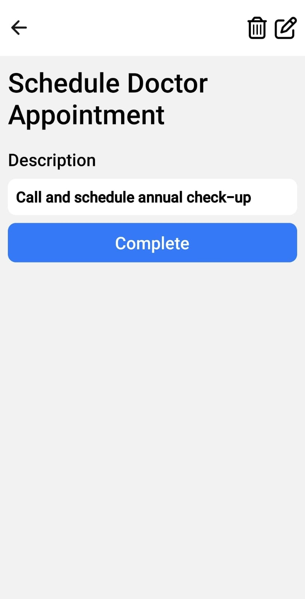

# Habit Tracker App

## 📱 About the App

### Why I Built This

I created this app to better organize my life. While searching for a habit tracker app, I couldn't find one that did everything I wanted. For me, a habit tracker is crucial as it helps manage life, increase effectiveness, and track habits. I needed an app I could adapt to my specific needs.

While this was initially a personal project, I believe it could be valuable for others too. Currently, it's not available on any app store, but if there's enough demand, I might consider publishing it there. For now, if you'd like to try it, you can either:

- Follow the guide below to set up your own instance (if you have basic programming knowledge)
- Or download the APK to test and provide feedback

### Features

A habit and task tracking application that allows you to:

- Create and manage daily habits
- Track tasks
- View progress statistics
- Completion calendar
- Streak system to maintain motivation

## 📸 Demo

### Screenshots

#### Authentication Flow

<div align="center">
  
  
  
</div>

#### Main App Flow

<div align="center">
  
  
  
</div>

#### Habit Management

<div align="center">
  
  
</div>

#### Task Management

<div align="center">
  
  
</div>

#### Statistics & Settings

<div align="center">
  
  
  
</div>

### Demo Video

[Add a link to the demo video here]

## ⬇️ Download

### Android (APK)

[APK download link](https://expo.dev/artifacts/eas/4ERtk3Gib7mbEpcfrtbt95.apk)

**Important Note**: The downloadable APK is for demonstration purposes only, allowing you to test the app's functionality. The data in this demo version is cleaned weekly, so it's not suitable for long-term personal use. If you want to use the app for your personal tracking:

1. Fork the project
2. Set up your own Firebase instance
3. Build your own version

## 🚀 Running Locally

### Prerequisites

- Node.js
- npm or yarn
- Expo CLI (`npm install -g expo-cli`)

### Firebase Setup

1. Go to [Firebase Console](https://console.firebase.google.com/)
2. Create a new project
3. In "Project Settings", find Firebase credentials
4. Create a `.env` file in the project root with the following variables:

```env
FIREBASE_API_KEY=your_api_key
FIREBASE_AUTH_DOMAIN=your_auth_domain
FIREBASE_PROJECT_ID=your_project_id
FIREBASE_STORAGE_BUCKET=your_storage_bucket
FIREBASE_MESSAGING_SENDER_ID=your_messaging_sender_id
FIREBASE_APP_ID=your_app_id
```

### Installation Steps

1. Fork this repository
2. Clone your fork:

```bash
git clone https://github.com/your-username/habit-tracker-app.git
```

3. Install dependencies:

```bash
cd habit-tracker-app
npm install
```

4. Configure Firebase as per instructions above

5. Start the app:

```bash
npx expo start
```

## 🛠️ Technologies Used

- React Native
- Expo
- Firebase
- TypeScript

## 🤝 Contributions

While this is an open-source project and suggestions are welcome, the demo APK is intended only for testing and providing feedback. For personal use, please set up your own instance following the guide above.

## ⚠️ Important Notice

Firebase data is cleaned weekly through a cron job. If you plan to use this app, set up your own Firebase instance following the instructions above.
